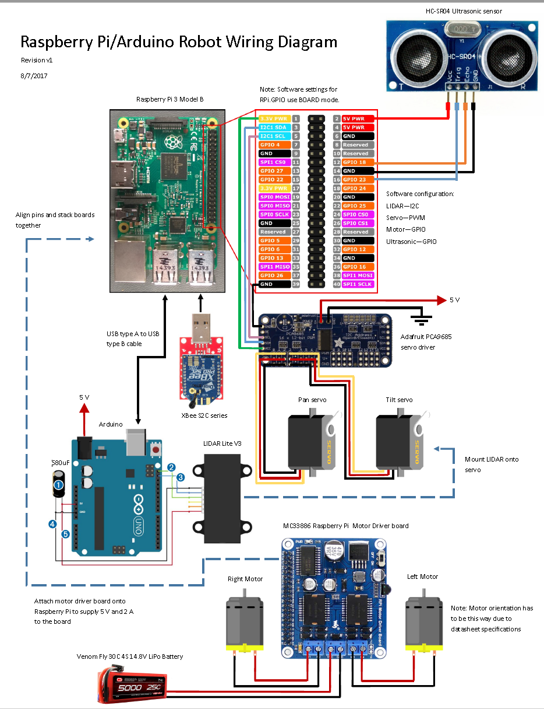

# Pi-Blockchain


Python code used to run an autonomous robot built using Arduino, Raspberry Pi, servos, motors, ultrasonic sensors, LIDAR sensors, XBee, and blockchain technology. The robot initially turns the LIDAR to the left, right, and center to determine the longest direction through multiple readings, removes outliers, and returns a median value. It then moves the motors towards the direction of the farthest distance. The robot takes readings while in motion for collision checking using the ultrasonic sensors. If it encounters an obstacle, it stops and calibrates again to determine the next longest direction and then moves towards that direction.

For MVP test demos between the cars, look in the `demos/MVP` directory.

This repository contains several modules:
* LIDAR_test - LIDAR sensor test module
* motor_test - Motor test module
* servo_test - Servo test module
* ultrasonic_test - Ultrasonic sensor test module
* xbee_test - XBee test module
* demos/ - Test demos for autonomous cars

Run with program with:
```
python main.py
```
- `main.py` - Main driver.
- `LIDARcontrol.py` - Module to read LIDAR sensor data on Raspberry Pi from Arduino through serial port.
- `motorControl.py` - Module for motor control.
- `servoControl.py` - Module for servo control.
- `ultrasonicControl.py` - Module for reading ultrasonic sensor data on Raspberry Pi.
- `xbeeControl.py` - Module for wireless communication on Raspberry Pi.
- `auxiliary.py` - Auxiliary functions such as releasing GPIO pins data logging.

# Parts
* Iron Man-4 Indoor Tracked Chassis with motors
    * http://www.robotshop.com/en/iron-man-4-indoor-tracked-chassis.html
* Arduino Uno R3 (Atmega328)
    * https://www.adafruit.com/product/50
* LIDAR Lite V3
    * https://www.sparkfun.com/products/14032
* Adafruit 16-Channel 12-bit PWM/Servo Driver - I2C interface - PCA9685
    * https://www.adafruit.com/product/815
* MC33886 Raspberry Pi Motor Driver Board for Raspberry Pi
    * http://www.robotshop.com/en/mc33886-raspberry-pi-motor-driver-board-raspberry-pi.html
* SparkFun XBee Explorer Dongle
    * https://www.sparkfun.com/products/11697
* SMAKN Dc/dc Converter 12v Step Down to 5v/3a Power Supply Module
    * https://www.amazon.com/dp/B00CXKBJI2/ref=cm_sw_r_cp_ep_dp_bpzxzb294NQJ7
* Lynxmotion Micro Pan and Tilt Kit with Servos (for LIDAR)
    * http://www.robotshop.com/en/lynxmotion-micro-pan-and-tilt-kit-with-servos-black.html?gclid=COqk_-jH0tQCFROBswod3hUNpg#reviewBox
* Raspberry Pi 3 Model B
    * https://www.adafruit.com/product/3055
* Xbee S2C series (XB24CZ7WIT-004)
    * https://www.adafruit.com/product/968
* HC-SR04 Ultrasonic Range Finder
    * http://www.robotshop.com/en/hc-sr04-ultrasonic-range-finder.html
* Lynxmotion Aluminum Multi-Purpose Sensor Bracket (for ultrasonic)
    * http://www.robotshop.com/en/lynxmotion-multi-purpose-sensor-housing.html
* USB Battery Pack for Raspberry Pi (10000mAh)
    * https://www.adafruit.com/product/1566
* USB to USBMicro (for battery pack to Pi3)
    * https://www.amazon.com/Eversame-USB2-0-4-Pack-Charge-Samsung/dp/B01K7DSRRC/ref=sr_1_4?ie=UTF8&qid=1498184169&sr=8-4&keywords=8%22+usb+to+micro+usb
* Servo Motors for LIDAR
    * https://www.amazon.com/Hitec-31311S-HS-311-Standard-Universal/dp/B0006O3WVE/ref=sr_1_13?ie=UTF8&qid=1502217287&sr=8-
* Venom Fly 30C 4S 5000mAh 14.8V LiPo Battery
    * https://www.amazon.com/Venom-5000mAh-14-8V-Battery-Deans/dp/B016ZM1S66/ref=sr_1_1?s=toys-and-

# Robot Wiring Diagram

